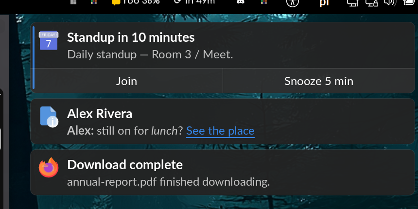
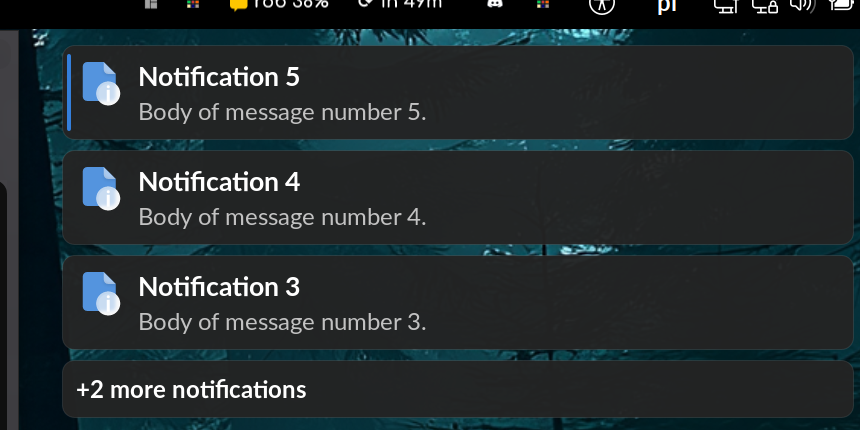
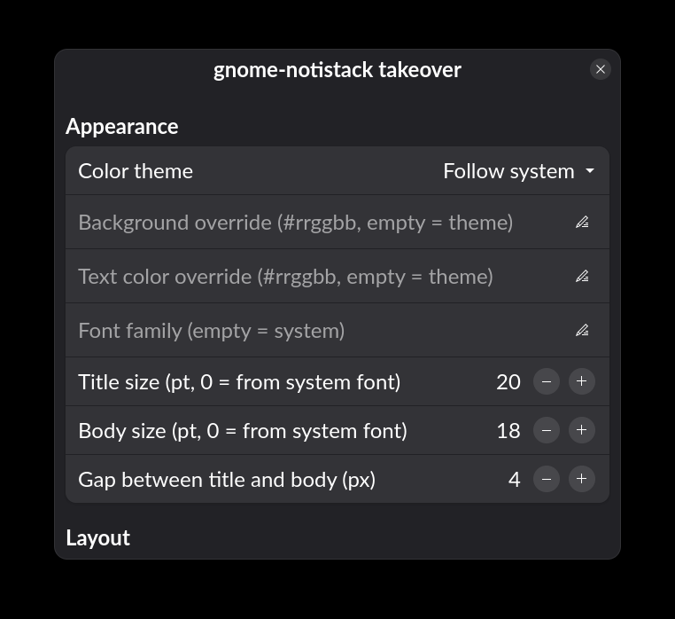

# gnome-notistack 🔔

**A notification daemon for GNOME Shell 48 on X11 that shows multiple notifications stacked at once** — the dunst experience, on GNOME, without losing any notifications you'd normally see.

GNOME Shell displays one notification banner at a time; the rest queue out of sight. `gnome-notistack` takes over the notification D-Bus names and renders its own vertical stack of translucent override-redirect popups, while a companion shell extension hands the names over from the shell.



## Features

- **Stacked popups** — several notifications visible at once, newest first.
- Handles **both** notification systems: `org.freedesktop.Notifications` (`notify-send`, most apps) **and** `org.gtk.Notifications` (native-GTK / Flatpak apps).
- Rich content: icons (PNG/JPEG/**SVG**/inline image data), **Pango markup** (`<b> <i> <u>`), **hyperlinks** (click to open), inline `` images, and line breaks.
- **Action buttons** rendered as a bottom bar; clicking the card invokes its default action.
- **Hover highlights** + a hand cursor on buttons and links.
- A discrete **accent stripe** on the freshest notification.
- **"+N more" overflow tile** when the stack is full — click it to reveal the hidden ones.
- **Configurable placement** — six positions (corners + top/bottom centre); bottom positions stack upward.
- **Theme-aware** colours (Adwaita light/dark) + your system font; geometry-based width that adapts to each monitor.
- Urgency-aware expiry with optional **min/max display-time caps**.
- **Suppression** during Do-Not-Disturb, screen lock, and fullscreen — suppressed notifications are queued and replayed, never lost.
- Mirrors shown notifications into GNOME's **date-menu** list.
- **Screen-reader announcements** via AT-SPI (Orca) — opt-in.
- Notification **sounds** and a persisted **history**.
- Everything is configurable from a **GTK preferences window** (GSettings) and applied **live**.

| Stack + buttons + markup | Overflow tile | Preferences |
|---|---|---|
|  |  |  |

## Requirements

- **GNOME Shell 48** on **X11** (the bus-name takeover and override-redirect rendering are X11-specific; Wayland is not supported).
- The mutter compositor (default on GNOME/X11) for the translucent popups.

## Install

### Debian / Ubuntu (`.deb`) — recommended

Grab the `.deb` matching your distro from the [Releases](../../releases) page, then:

```sh
sudo apt install ./gnome-notistack_<version>_<distro>.deb
systemctl --user enable --now gnome-notistack
gnome-extensions enable notistack@hemoglobina.store
```

Log out and back in once so the companion extension loads.

### Portable tarball (any X11 + GNOME 48 distro)

```sh
tar xzf gnome-notistack-<version>-x86_64-<distro>.tar.gz
cd gnome-notistack-<version>-x86_64-<distro>
./install.sh           # per-user install, no root
```

Uninstall with `./install.sh --uninstall`.

### From source

```sh
# Debian/Ubuntu build dependencies:
sudo apt install build-essential pkg-config \
  libglib2.0-dev libcairo2-dev libpango1.0-dev libgdk-pixbuf-2.0-dev \
  libxcb1-dev libxcb-randr0-dev libxcb-shape0-dev libxcb-xfixes0-dev

cargo build --release                       # daemon → target/release/gnome-notistack
cargo install cargo-deb && cargo deb -p gnome-notistack   # optional .deb
```

Targets **rustc 1.91+**. The GNOME extension lives in [`extension/`](extension); copy it to `~/.local/share/gnome-shell/extensions/notistack@hemoglobina.store` (the `.deb`/tarball do this for you).

## Configuration

Zero-config by default — colours and font follow your GNOME theme. Open the preferences window:

```sh
gnome-extensions prefs notistack@hemoglobina.store
```

Changes apply **live** (the daemon re-reads GSettings about once a second). You can also use `gsettings` directly, e.g.:

```sh
gsettings set org.gnome.shell.extensions.notistack placement 'bottom-right'
gsettings set org.gnome.shell.extensions.notistack theme-mode 'dark'
```

### Settings reference

All keys live under `org.gnome.shell.extensions.notistack`.

**Appearance**

| Key | Default | Meaning |
|---|---|---|
| `theme-mode` | `auto` | Colour mode: `auto` (follow system), `light`, or `dark`. |
| `background-color` | `''` | Background override (`#rrggbb`/`#rrggbbaa`); empty = theme. |
| `foreground-color` | `''` | Text-colour override; empty = theme. |
| `font-family` | `''` | Font family; empty = system interface font. |
| `summary-size-pt` | `0` | Title size in pt; `0` = from the system font. |
| `body-size-pt` | `0` | Body size in pt; `0` = from the system font. |
| `title-body-gap-px` | `4` | Gap between the title and the body. |

**Layout**

| Key | Default | Meaning |
|---|---|---|
| `placement` | `top-right` | `top/bottom` × `left/center/right`. Bottom positions stack upward. |
| `monitor` | `primary` | `primary`, `focused` (the monitor under the pointer), or a connector like `DP-1`. |
| `width-height-fraction` | `0.30` | Popup width as a fraction of monitor **height**. |
| `max-width-fraction` | `0.18` | Cap on width as a fraction of monitor **width**. |
| `width-px` | `0` | Absolute width in px; `0` = derive from geometry above. |
| `gap-px` | `10` | Vertical gap between popups. |
| `margin-px` | `16` | Margin from the screen edge. |
| `max-stack` | `5` | Maximum simultaneous popups before the "+N more" tile appears. |

**Timing**

| Key | Default | Meaning |
|---|---|---|
| `default-timeout-ms` | `5000` | Default display time. |
| `low-urgency-timeout-ms` | `3000` | Display time for low-urgency notifications. |
| `min-timeout-ms` | `0` | Floor on display time; `0` = respect each notification's own timeout. |
| `max-timeout-ms` | `0` | Hard cap on display time (force-closes "never expire" popups); `0` = off. |
| `fade-ms` | `150` | Fade in/out duration; `0` disables fading. |

**Behavior**

| Key | Default | Meaning |
|---|---|---|
| `history-size` | `100` | Notifications kept in history. |
| `suppress-on-fullscreen` | `true` | Hide popups while a fullscreen window is focused. |
| `gtk-takeover` | `true` | Also take over `org.gtk.Notifications` (takes effect on the next daemon start). |
| `a11y-announce` | `false` | Announce notifications to screen readers (AT-SPI / Orca). |

## How it works

GNOME's `MessageTray` only shows one banner at a time. The companion extension frees the notification bus names from the shell (SIGTERM the `org.freedesktop.Notifications` proxy; `ReleaseName` for `org.gtk.Notifications`), and the already-running daemon — which started **queued** behind the shell — is promoted to owner by D-Bus. The daemon then renders the stack itself with cairo/pango onto ARGB override-redirect windows. On disable, the extension hands the names back to the shell (no shell restart needed). See the [wiki](../../wiki) for details.

## Documentation

Installation, configuration, and troubleshooting guides live in the **[wiki](../../wiki)**.

## Limitations

- **X11 + GNOME 48 only** — no Wayland support.
- AT-SPI support is **announcements-only** for now (no navigable accessible tree yet).
- If the daemon is restarted mid-session, the extension re-runs the takeover automatically.

## License

[MIT](LICENSE) © Hibryda.
